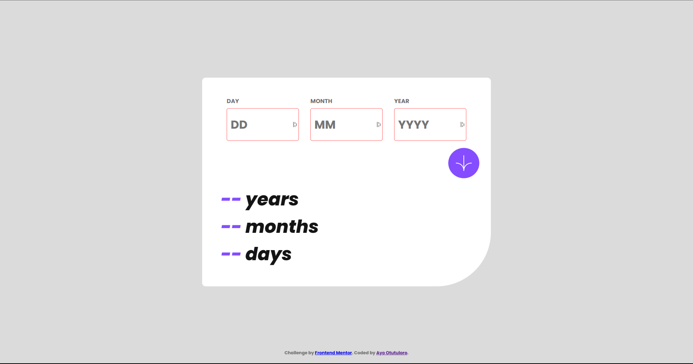

# age-calc-app

## Project setup
```
npm install
```

### Compiles and hot-reloads for development
```
npm run serve
```

### Compiles and minifies for production
```
npm run build
```

### Lints and fixes files
```
npm run lint
```

### Customize configuration
See [Configuration Reference](https://cli.vuejs.org/config/).

# Frontend Mentor - Age calculator app solution

This is a solution to the [Age calculator app challenge on Frontend Mentor](https://www.frontendmentor.io/challenges/age-calculator-app-dF9DFFpj-Q). Frontend Mentor challenges help you improve your coding skills by building realistic projects. 

## Table of contents

- [Overview](#overview)
  - [The challenge](#the-challenge)
  - [Screenshot](#screenshot)
  - [Links](#links)
- [My process](#my-process)
  - [Built with](#built-with)
  - [What I learned](#what-i-learned)
  - [Useful resources](#useful-resources)
- [Author](#author)
## Overview

### The challenge

Users should be able to:

- View an age in years, months, and days after submitting a valid date through the form
- Receive validation errors if:
  - Any field is empty when the form is submitted
  - The day number is not between 1-31
  - The month number is not between 1-12
  - The year is in the future
  - The date is invalid e.g. 31/04/1991 (there are 30 days in April)
- View the optimal layout for the interface depending on their device's screen size
- See hover and focus states for all interactive elements on the page

### Screenshot




### Links

- Solution URL: [Solution URL](https://www.frontendmentor.io/solutions/age-calculator-app-made-with-vuejs-oPY2s6EjPr)
- Live Site URL: [Live site](https://archers-age-calc.netlify.app/)

## My process

### Built with

- Semantic HTML5 markup
- CSS custom properties
- Flexbox
- [Vue.js](https://vuejs.org/) - JS library

### What I learned

I mainly improved my skills writing Vue.js, and especially mobile and responsive designs.

### Useful resources

- [Age calculator](https://www.tutorialstonight.com/age-calculator-in-javascript) - This helped me get the math for calculating ages down. Math isn't really my strong point so it was very useful.
- [Vue.js](https://vuejs.org/) - This is the documentation for Vue.js. It's very useful and I recommend it to anyone who wants to learn Vue.js.

## Author

- Website - [Ayo Otutuloro](https://darkerarcher.netlify.app/)
- Frontend Mentor - [@darkerarcher](https://www.frontendmentor.io/profile/darkerarcher)
- Twitter - [@darkerarcher](https://www.twitter.com/darkerarcher)
